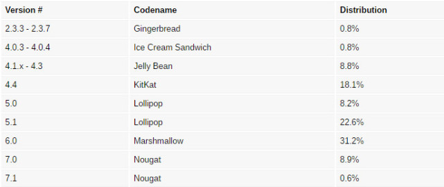
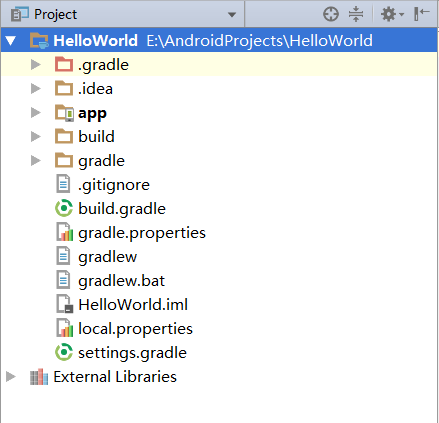
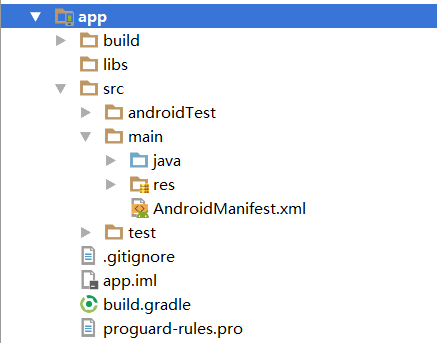

### Android大致可以分为四层架构：
1. Linux内核层
2. 系统运行库层
3. 应用框架层
4. 应用层

***

### Android系统架构图


***

### Android系统版本分布图



---

### 准备工具
- JDK
> 包含Java的运行环境、工具集合、基础类库等。

- Android SDK
- Android Studio

---

### 项目目录结构



1. .gradle和.idea
> Android Studio自动生成的一些文件，不需要关心。

2. app
> 项目的中代码、资源等基本都是放在这个目录下面的。

3. build
> 编译时自动生成的文件，不需要关心。

4. gradle
> 包含了gradle wrapper的配置文件，使用gradle wrapper的方式不需要提前将gradle下载好，
> 而是会自动根据本地的缓存情况决定是否需要去下载gradle。
> Android Studio默认没有启用gradle wrapper的方式，如果需要打开，
> 点击File/Settings/Build,Execution,Deployment/Gradle，进行配置。

5. .gitignore
> 用来将指定的文件或目录排除在版本控制之外。

6. build.gradle
> 项目全局的gradle构建脚本，通常不需要修改。

7. gradle.properties
> 全局的gradle配置文件，在这里配置的属性将会影响到项目中所有的gradle编译脚本。

8. gradlew和gradlew.bat
> 用来在命令行界面中执行gradle命令，gradlew是在Linex或Mac系统中使用的，
> gradlew.bat是在Windows系统中使用的。

9. HelloWorld.iml
> iml文件所有IntelliJ IDEA项目都会自动生成的一个文件，
> 用于标识这是一个IntelliJ IDEA项目。不需要修改。

10. local.properties
> 用于指定本机中Android SDK路径。 通常是自动生成的。

11. settings.gradle
> 用于指定项目中所有引入的模块。模块的引入通常是自动完成的。

---

### app目录结构



1. .build
> 编译时自动生成的文件，不需要关心。

2. libs
> 放置项目中使用到的第三方jar包，放在这里的jar包都会被自动添加到构建路径中去。

3. androidTest
> 用来编写Android Test测试用例。

4. java
> 放置所有Java代码的地方。

5. res
> 放置项目中使用到的所有图片、布局、字符串等资源。

6. AndroidManifest.xml
> 整个项目的配置文件，
> 在程序中定义的所有四大组件都需要在这个文件里注册，
> 给应用程序添加权限声明也在这个文件里。

7. test
> 用来编写Unit Test测试用例的。

8. .gitignore
> 用于将app模块内的指定的文件或目录排除在版本控制之外。

9. app.iml
> IntelliJ IDEA项目自动生成的文件，不需要关心。

10. build.gradle
> app模块的gradle构建脚本，这里会指定很多项目构建相关的配置。

11. proguard-rules.pro
> 用于指定项目代码的混淆规则。

---

### Android四大组件
> 活动(Activity)、服务(Service)、广播接收器(Broadcast Reveiver)、内容提供器(Content Provider)

#### 1. 活动(Activity)
> 是一种可以包含用户界面的组件，主要用于和用户进行交互。
> 简单来说就是我们所看到的应用程序的页面，就叫活动。

- 给主活动指定的label不仅会成为标题栏中的内容，还会成成为应用程序的名称。

- 通过getMenuInflater()方法能够得到MenuInflater对象，再调用它的inflater()方法，
就可以给当前活动创建菜单了。
`getMenuInflater().inflate(R.menu.menufile, menu);`

- Intent一般可用于启动活动、启动服务以及发送广播等场景。

- Intent可分为：显示Intent和隐式Intent。

- 每个Intent中只能指定一个action，但可以指定多个catetory。

- 向下一个Activity传递数据

```
    在第一个Activity中这样传递数据：
    String data = "Hello ScecondActivity";
    Intent intent = new Intent(FirstActivity.this, SecondActivity.class);
    intent.putExtra("extra_data", data);
    startActivity(intent);

    在第二个Activity中这样接收数据：
    Intent intent = getIntent();
    String data = intent.getStringExtra("extra_data");
```

- 返回数据给上一个Activity
```
    在第一个Activity中：
    Intent intent = new Intent(FirstActivity.this, SecondActivity.class);
    // 第二个参数为请求码，用于之后的onActivityResult方法里。
    startActivityForResult(intent, 1);

    @Override
    protected void onActivityResult(int requestCode, int resultCode, Intent data) {
        switch (requestCode) {
            case 1:
                if (resultCode == RESULT_OK) {
                    String retData = data.getStringExtra("data_return");
                }
                break;
        }
    }
```

#### 2. 服务(Service)
> 在后台默默地运行，即使退出了应用，服务仍然可以继续运行。

#### 3. 广播接收器(Broadcast Reveiver)
> 可以接收来自各处的广播消息，如电话，短信等。

#### 4. 内容提供器(Content Provider)
> 为应用程序之间提供共享数据，比如想读取系统联系人，就要通过内容提供器。

