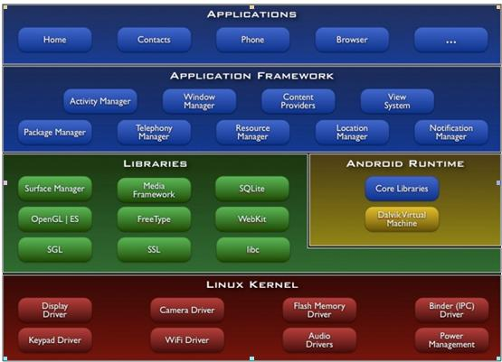
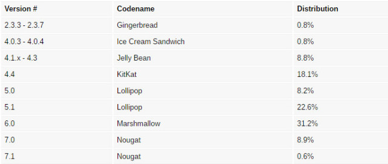
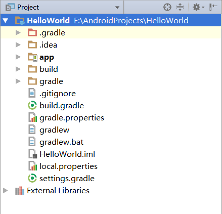
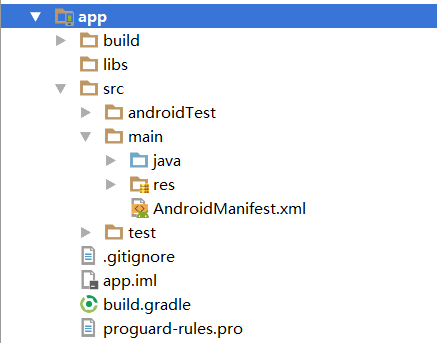
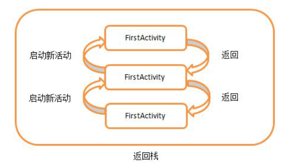
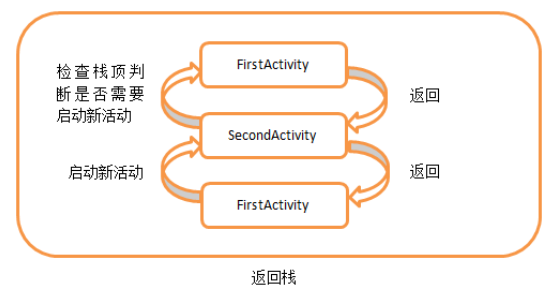
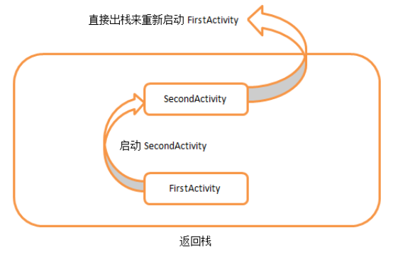
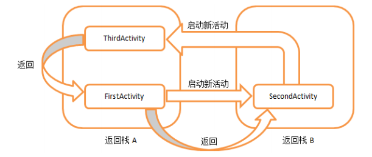
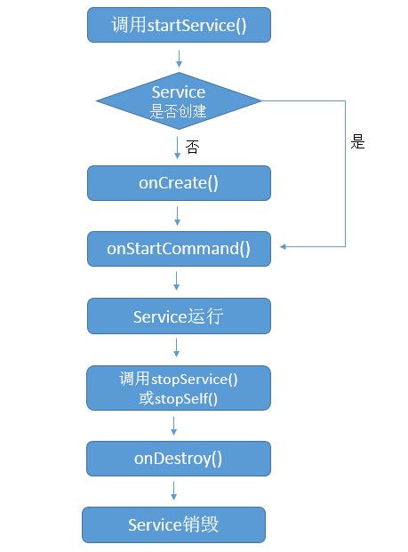
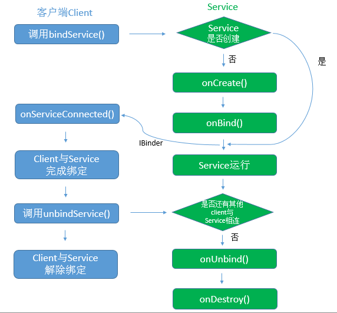

# Android大致可以分为四层架构：
1. Linux内核层
2. 系统运行库层
3. 应用框架层
4. 应用层

***

# Android系统架构图



***

# Android系统版本分布图



---

# 准备工具
- JDK
> 包含Java的运行环境、工具集合、基础类库等。

- Android SDK
- Android Studio

---

# 项目目录结构



1. .gradle和.idea
> Android Studio自动生成的一些文件，不需要关心。

2. app
> 项目的中代码、资源等基本都是放在这个目录下面的。

3. build
> 编译时自动生成的文件，不需要关心。

4. gradle
> 包含了gradle wrapper的配置文件，使用gradle wrapper的方式不需要提前将gradle下载好，
> 而是会自动根据本地的缓存情况决定是否需要去下载gradle。
> Android Studio默认没有启用gradle wrapper的方式，如果需要打开，
> 点击File/Settings/Build,Execution,Deployment/Gradle，进行配置。

5. .gitignore
> 用来将指定的文件或目录排除在版本控制之外。

6. build.gradle
> 项目全局的gradle构建脚本，通常不需要修改。

7. gradle.properties
> 全局的gradle配置文件，在这里配置的属性将会影响到项目中所有的gradle编译脚本。

8. gradlew和gradlew.bat
> 用来在命令行界面中执行gradle命令，gradlew是在Linex或Mac系统中使用的，
> gradlew.bat是在Windows系统中使用的。

9. HelloWorld.iml
> iml文件所有IntelliJ IDEA项目都会自动生成的一个文件，
> 用于标识这是一个IntelliJ IDEA项目。不需要修改。

10. local.properties
> 用于指定本机中Android SDK路径。 通常是自动生成的。

11. settings.gradle
> 用于指定项目中所有引入的模块。模块的引入通常是自动完成的。

---

# app目录结构



1. .build
> 编译时自动生成的文件，不需要关心。

2. libs
> 放置项目中使用到的第三方jar包，放在这里的jar包都会被自动添加到构建路径中去。

3. androidTest
> 用来编写Android Test测试用例。

4. java
> 放置所有Java代码的地方。

5. res
> 放置项目中使用到的所有图片、布局、字符串等资源。

6. AndroidManifest.xml
> 整个项目的配置文件，
> 在程序中定义的所有四大组件都需要在这个文件里注册，
> 给应用程序添加权限声明也在这个文件里。

7. test
> 用来编写Unit Test测试用例的。

8. .gitignore
> 用于将app模块内的指定的文件或目录排除在版本控制之外。

9. app.iml
> IntelliJ IDEA项目自动生成的文件，不需要关心。

10. build.gradle
> app模块的gradle构建脚本，这里会指定很多项目构建相关的配置。

11. proguard-rules.pro
> 用于指定项目代码的混淆规则。

---

# Android四大组件
> 活动(Activity)、服务(Service)、广播接收器(Broadcast Reveiver)、内容提供器(Content Provider)

## 1. 活动(Activity)
> 是一种可以包含用户界面的组件，主要用于和用户进行交互。
> 简单来说就是我们所看到的应用程序的页面，就叫活动。

- 给主活动指定的label不仅会成为标题栏中的内容，还会成成为应用程序的名称。

- 通过getMenuInflater()方法能够得到MenuInflater对象，再调用它的inflater()方法，
就可以给当前活动创建菜单了。
`getMenuInflater().inflate(R.menu.menufile, menu);`

- Intent一般可用于启动活动、启动服务以及发送广播等场景。

- Intent可分为：显示Intent和隐式Intent。

- 每个Intent中只能指定一个action，但可以指定多个catetory。

- 向下一个Activity传递数据

```java
    // 在第一个Activity中这样传递数据
    String data = "Hello ScecondActivity";
    Intent intent = new Intent(FirstActivity.this, SecondActivity.class);
    intent.putExtra("extra_data", data);
    startActivity(intent);

    // 在第二个Activity中这样接收数据
    Intent intent = getIntent();
    String data = intent.getStringExtra("extra_data");
```

- 返回数据给上一个Activity
```java
    // 在第一个Activity中
    Intent intent = new Intent(FirstActivity.this, SecondActivity.class);
    /**
     * 第二个参数为请求码，用于之后的onActivityResult方法里。
     * 由于使用startActivityForResult来启动第二个Activity，
     * 所以在第二个Activity返回的时候，会回调上一个Activity的onActivityResult方法。
     */
    startActivityForResult(intent, 1);

    @Override
    protected void onActivityResult(int requestCode, int resultCode, Intent data) {
        switch (requestCode) {
            case 1:
                if (resultCode == RESULT_OK) {
                    String retData = data.getStringExtra("data_return");
                }
                break;
        }
    }

    // 在第二个Activity中，创建一个Intent对象，只是用来传递返回的数据
    Intent intent = new Intent();
    intent.putExtra("data_return", "Hello FirstActivity");
    setResult(RESULT_OK, intent);
    finish();
```

### 活动状态

1. 运行状态
> 当一个活动位于返回栈的栈顶时，就时活动就处于运行状态。

2. 暂停状态
> 当一个活动不再处于栈顶位置，但仍然可见的时候。

3. 停止状态
> 当一个活动不再处于栈顶位置，并且完全不可见的时候。

4. 销毁状态
> 当一个活动从返回栈中移除后就变成了销毁状态。

### 活动生命周期

- onCreate()
> 活动第一次被创建时调用。

- onStart()
> 活动由不可见变为可见时调用。

- onResume()
> 活动准备好和用户进行交互时调用。此时活动一定位于栈顶，并且处于运行状态。

- onPause()
> 系统准备去启动或恢复另一个Activity时调用。

- onStop()
> 活动完全不可见的时候调用。

- onDestory()
> 活动被销毁之前调用，之后Activity的状态将变为销毁状态。

- onRestart()
> 活动由停止状态变为运行状态之前调用，也就是活动被重新启动了。

### 流程图


### 指定一个Activity为Dialog形式
```
    <activity android:name=".DialogActivity"
        android:theme="@android:style/Theme.Dialog">
    </activity>
```

### Activity进入停止状态，被系统回收了，然后重新恢复时，数据的保存和恢复
> 在onSaveInstanceState保存数据，然后在onCreate里恢复数据

```java
    @Override
    protected void onSaveInstanceState(Bundle outState) {
        super.onSaveInstanceState(outState);
        String tempData = "Data need to save";
        outState.putString("data_key", tempData);
    }

    @Override
    protected void onCreate(Bundle savedInstanceState) {
        super.onCreate(savedInstanceState);
        setContentView(R.layout.activity_main);
        if (savedInstanceState != null) {
            String tempData = savedInstanceState.getString("data_key");
        }
    }
```

### Activity启动模式
> Activity的四种启动模式：standard、singleTop、singleTask、singleInstance。

- 在AndroidManifest.xml中通过<activity>标签的android:launchMode属性来指定启动模式。

```xml
    <activity
        android:name=".FirstActivity"
        android:launchMode="singleTop">
    </activity>
```

#### 1. standard

> Activity的默认启动模式。
> 对于使用standard模式的Activity，系统不会在乎这个Activity是否已经存在，
> 每次启动都会创建该Activity的一个实例。



#### 2. singleTop

> Acitivity启动模式指定为singleTop时，
> 在启动Activity时，如果发现栈顶已经是该Activity了，就不会再创建新的Activity了，
> 如果该Activity不在栈顶，还是会创建该Activity新的实例。



#### 3. singleTask

> Activity启动模式指定为singleTask时，
> 每次启动该Activity时，系统都会在返回栈中检查是否已经存在该Activity的实例，
> 如果已经存在，会把这个Activity之上的所有其它Activity全部出栈，
> 如果没有，就会创建一个新的Activity实例。



#### 4. singleInstance

> 如果Activity启动模式指定为singleInstance，
> 系统会启用一个新的返回栈来管理这个Activity。



### 杀掉当前进程
> killProcess()方法用于杀掉一个进程，只能用于杀掉当前程序的进程。

```java
    android.os.Process.killProcess(android.os.Process.myPid());
```

## 2. 服务(Service)
> 在后台默默地运行，即使退出了应用，服务仍然可以继续运行。

### 线程的基本用法

```java
    new Thread(new Runnable() {
        @Override
        public void run() {
             // 处理具体逻辑
        }
    }).start();
```

### 使用AsyncTask进行异步处理

#### 使用步骤：

1. 创建一个子类继承自AsyncTask。
2. 根据需求指定3个泛型参数类型。
> 第一个参数：执行AsyncTask时需要传入的参数。  
> 第二个参数：在后台执行任务时，如果需要显示进度，则做为进度单位。  
> 第三个参数：任务执行完成后，如果需要返回结果，这里指定返回类型。
3. 要启动任务，调用 new DownloadTask().execute();就可以了。

```java
    class DownloadTask extends AsyncTask<void, Integer, Boolean> {
        @Override
        protected void onPreExecute() {
            super.onPreExecute();
            // 后台任务开始之前调用
        }

        @Override
        protected Boolean doInBackground(void... params) {
            // 这个方法中的所有代码都会在子线程中运行
            // 任务完成通过return返回
            // 更新UI通过调用publishProgress(progress...)
            return true;
        }

        @Override
        protected void onProgressUpdate(Integer... values) {
            super.onProgressUpdate(values);
            // 如果在后台任务中调用了publishProgress(progress...)，
            // 该方法很快就会被调用
            // 在此方法中可以更新UI
        }

        @Override
        protected void onPostExecute(Boolean aBoolean) {
            super.onPostExecute(aBoolean);
            // 如果后台任务通过return返回时，
            // 该方法很快就会被调用
            // 在此方法中可以更新UI
        }
    }
```

### 使用Service有两种主要方式：
> 1. 通过调用Context的startService  
> 2. 通过调用Context的bindService

#### 1. startService方式
> 通过startService方法启动的Service会一直无限期地运行下去，  
> 只有在外部调用Context的stopService或Service内部调用Service的stopSelf方法，  
> 该Service才会停止运行并销毁。

##### 要使用Service，要继承自Service然后重写下面的方法：
```java
public class MyService extends Service {

    @Override
    public void onCreate() {
        super.onCreate();
        // 执行startService时，
        // 1.如果Service没有运行，则会创建Service并且执行Service的onCreate
        // 2.如果Service已经处于运行中，，则不会执行onCreate
    }

    @Override
    public int onStartCommand(Intent intent, int flags, int startId) {
        return super.onStartCommand(intent, flags, startId);
        // 每次执行startService，都会执行onStartCommand方法。
    }

    @Override
    public IBinder onBind(Intent intent) {
        // TODO: Return the communication channel to the service.
        // 该方法是Service的抽象方法，必须重写
        // 没用用到返回null就行，比如通过startService启动时。
    }

    @Override
    public void onDestroy() {
        super.onDestroy();
        // 当调用Context的stopService或Service的stopSelf时,
        // Service才会停止运行并销毁。
    }
}
```

##### 通过startService启动的Service的生命周期:



#### 2. bindService方式

##### 先创建Service，然后在Service内部创建Binder
> 这个Binder就是用来实现Activity和Service之间通信的

```java
public class MyService extends Service {

    public class MYBinder extends Binder {

        public MyService getService() {
            return MyService.this;
        }
    }

    // 通过binder实现调用者client与service之间的通信
    private MYBinder binder = new MYBinder();

    @Override
    public void onCreate() {
        super.onCreate();
    }

    @Override
    public IBinder onBind(Intent intent) {
        return binder;
    }

    @Override
    public boolean onUnbind(Intent intent) {
        return super.onUnbind(intent);
    }

    @Override
    public void onDestroy() {
        super.onDestroy();
    }
}
```

##### 然后在Activity里创建ServiceConnect
> 当执行onServiceConnected时，可以通IBinder得到servie实例，  
> 这样就实现了Activity和Service的连接了。

```java
    private ServiceConnection connection = new ServiceConnection() {
        @Override
        public void onServiceConnected(ComponentName name, IBinder binder) {
            MyService.MYBinder myBinder = (MyService.MYBinder)binder;
            service = myBinder.getService();
        }

        @Override
        public void onServiceDisconnected(ComponentName name) {
        }
    };
```

##### 通过bindService启动的Service的生命周期:



### 使用IntentService

> Android提供了一个IntentService类，专门用于自动开户线程，  
> 服务运行完成，自动停止服务。

```java
public class MyIntentService extends IntentService {
    
    public MyIntentService() {
        super("MyIntentService");
    }

    @Override
    protected void onHandleIntent(Intent intent) {
        // 在这里处理服务逻辑，处理完成会自动退出
    }
}
    // 用法
    Intent intentService = new Intent(this, MyIntentService.class);
    startService(intentService);
```

## 3. 广播接收器(Broadcast Reveiver)
> 可以接收来自各处的广播消息，如电话，短信等。

### 广播有两种类型
> 标准广播和有序广播

#### 标准广播
> 是一种完全异步执行的广播

#### 有序广播
> 是一种同步执行的广播

- 注册广播有两种方式，在代码中注册和在AndroidManifest.xml中注册，在代码中注册的称为动态注册，在AndroidManifest.xml中注册的称为静态注册。

- 动态注册：
``` java
public class MainActivity extends AppCompatActivity {

    private IntentFilter intentFilter;
    private NetworkChangeReceiver networkChangeReceiver;

    @Override
    protected void onCreate(Bundle savedInstanceState) {
        super.onCreate(savedInstanceState);
        setContentView(R.layout.activity_main);

        intentFilter = new IntentFilter();
        intentFilter.addAction("android.net.conn.CONNECTIVITY_CHANGE");
        networkChangeReceiver = new NetworkChangeReceiver();
        registerReceiver(networkChangeReceiver, intentFilter);
    }

    @Override
    protected void onDestroy() {
        super.onDestroy();
        unregisterReceiver(networkChangeReceiver);
    }

    class NetworkChangeReceiver extends BroadcastReceiver {
        @Override
        public void onReceive(Context context, Intent intent) {
            // 处理接收广播
        }
    }
}
```

- 静态注册：
> 在AndroidManifest.xml中
```xml
    <receiver
        android:name=".BootCompleteReveiver"
        android:enabled="true"
        android:exported="true">
        <intent-filter>
            <action android:name="android.intent.action.BOOT_COMPLETED"/>
        </intent-filter>
    </receiver>
```
> 在代码中：
``` java
public class BootCompleteReveiver extends BroadcastReceiver {

    @Override
    public void onReceive(Context context, Intent intent) {
        // 处理接收到的广播
    }
}
```

- 发送广播:

```java
    Intent intent = new Intent("自定义的广播名称");
    // 发送广播
    sendBroadcast(intent);
    // 发送有序广播
    sendOrderedBroadcast(intent, null);
```

- 使用本地广播：

``` java
    LocalBroadcastManager localBroadcastManager;
    localBroadcastManager = LocalBroadcastManager.getInstance(this);
    Intent intent = new Intent("自定义的广播名称");
    // 发送广播
    localBroadcastManager.sendBroadcast(intent);
    // 发送有序广播
    localBroadcastManager.sendBroadcastSync(intent);
```

## 4. 内容提供器(Content Provider)
> 主要用于在不同的应用程序之间实现数据共享的功能，它提供了一套完整的机制，
> 允许一个程序访问另一个程序中的数据，同时还能保证被访数据的安全性。

### 运行时权限申请：
```java
    @Override
    protected void onCreate(Bundle savedInstanceState) {
        super.onCreate(savedInstanceState);
        setContentView(R.layout.activity_main);

        if (ContextCompat.checkSelfPermission(MainActivity.this, Manifest.permission.CALL_PHONE) != PackageManager.PERMISSION_GRANTED) {
            ActivityCompat.requestPermissions(MainActivity.this, new String[]{ Manifest.permission.CALL_PHONE }, 1);
        }
        else {
            call();
        }
    }

    private void call() {
        try {
            Intent intent = new Intent(Intent.ACTION_CALL);
            intent.setData(Uri.parse("tel:10086"));
            startActivity(intent);
        } catch (SecurityException e) {
            e.printStackTrace();
        }
    }

    @Override
    public void onRequestPermissionsResult(int requestCode, @NonNull String[] permissions, @NonNull int[] grantResults) {
        super.onRequestPermissionsResult(requestCode, permissions, grantResults);
        switch (requestCode) {
            case 1:
                if (grantResults.length > 0 && grantResults[0] == PackageManager.PERMISSION_GRANTED) {
                    call();
                }
                break;
            default:
                break;
        }
    }
```

### 一般有两种用法

- 使用现有的内容提供器来读取和操作相应程序中的数据。
- 创建自己的内容提供器给我们程序的数据提供外部访问接口。

#### 内容URI

>  内容URI给内容提供器中的数据建立唯一标识符。

- 标准写法：content://com.example.app.provider/table1
> 还可以在后面加一个id:content://com.example.app.provider/table1/id，  
> 表示期望访问talbe1表中id为xx的数据。  
> 支持用通配符来指定talbe和id，  
> \*：表示匹配任意长度的任意字符。  
> \#：表示匹配任意长度的数字。  
> content://com.example.app.provider/\* 表示匹配任意表的内容。  
> content://com.example.app.provider/table1/\# 表示匹配table1中任意一行的内容。

- 由两部分组成：authority和path
> authority用于对不同的应用程序做区分的，一般用包名命名。
> 如com.example.app.provider，
> path是用于对同一个程序中不同的表做区分的，添加到authority后面。
> 如/table1，
> content://为头部协议

- 读取系统联系人例子：
```java
    ArrayAdapter<String> adapter;
    List<String> contactsList = new ArrayList<>();

    @Override
    protected void onCreate(Bundle savedInstanceState) {
        super.onCreate(savedInstanceState);
        setContentView(R.layout.activity_main);

        ListView contactsView = (ListView) findViewById(R.id.contacts_view);
        adapter = new ArrayAdapter<String>(this, android.R.layout.simple_list_item_1, contactsList);
        contactsView.setAdapter(adapter);

        if (ContextCompat.checkSelfPermission(MainActivity.this, Manifest.permission.READ_CONTACTS) != PackageManager.PERMISSION_GRANTED) {
            ActivityCompat.requestPermissions(MainActivity.this, new String[]{ Manifest.permission.READ_CONTACTS }, 1);
        } else {
            readContacts();
        }
    }

    private void readContacts() {
        Cursor cursor = null;
        try {
            cursor = getContentResolver().query(ContactsContract.CommonDataKinds.Phone.CONTENT_URI, null, null, null, null);
            if (cursor != null) {
                while (cursor.moveToNext()) {
                    String displayName = cursor.getString(cursor.getColumnIndex(ContactsContract.CommonDataKinds.Phone.DISPLAY_NAME));
                    String number = cursor.getString(cursor.getColumnIndex(ContactsContract.CommonDataKinds.Phone.NUMBER));
                    contactsList.add(displayName + "\n" + number);
                }
                adapter.notifyDataSetChanged();
            }
        } catch (Exception e) {
            e.printStackTrace();
        } finally {
            if (cursor != null) {
                cursor.close();
            }
        }
    }

    @Override
    public void onRequestPermissionsResult(int requestCode, @NonNull String[] permissions, @NonNull int[] grantResults) {
        super.onRequestPermissionsResult(requestCode, permissions, grantResults);

        switch (requestCode) {
            case 1:
                if (grantResults.length > 0 && grantResults[0] == PackageManager.PERMISSION_GRANTED) {
                    readContacts();
                } else {
                    Toast.makeText(this, "You denied the permission", Toast.LENGTH_SHORT).show();
                }
                break;
            default:
                break;
        }
    }
```

#### 创建内容提供器

##### 新建一个类继承自ContentProvider
> 必须重写父类的6个抽象方法

```java
public class MyProvider extends ContentProvider {

    @Override
    public boolean onCreate() {
        // TODO: Implement this to initialize your content provider on startup.
        // 返回true表示初始化成功，返回false表示失败
        return false;
    }

    @Override
    public Cursor query(Uri uri, String[] projection, String selection,
                        String[] selectionArgs, String sortOrder) {
        // TODO: Implement this to handle query requests from clients.
        // 查询数据
    }

    @Override
    public int delete(Uri uri, String selection, String[] selectionArgs) {
        // Implement this to handle requests to delete one or more rows.
        // 删除数据
    }

    @Override
    public Uri insert(Uri uri, ContentValues values) {
        // TODO: Implement this to handle requests to insert a new row.
        // 添加数据
    }

    @Override
    public int update(Uri uri, ContentValues values, String selection,
                      String[] selectionArgs) {
        // TODO: Implement this to handle requests to update one or more rows.
        // 更新数据
    }

    @Override
    public String getType(Uri uri) {
        // TODO: Implement this to handle requests for the MIME type of the data
        // at the given URI.
        // 返回相应的MIME类型
        // 一个URI对应的MIME字符串主要由3部分组成：
        // 1.必须以vnd开头
        // 2.如果URI以路径结尾，后接android.cursor.dir/
        //   如果RUI以id结尾, 后接android.cursor.item/
        // 3.最后接上vnd.<authority>.<path>
    }
}
```

## 使用通知

### 创建通知的步骤

1. 使用NotificationManager来管理通知。
2. 使用Builder构造器来创建Notification对象。
3. 调用NotificationManager的notify()方法显示通知。

```java
    // 1.
    NotificationManager manager = getSystemService(Context.NOTIFICATION_SERVICE);
    // 2.
    Intent intent = new Intent(this, NotificationActivity.class);
    PendingIntent pi = PendingIntent.getActivity(this, 0, intent, 0);
    Notification notification = new NotificationCompat.Builder(context)
            .setContentTitle("This is title")
            .setContentText("This is content text")
            .setWhen(System.currentTimeMillis())
            .setSmallIcon(R.drawable.small_icon)
            .setLargeIcon(BitmapFactory.decodeResource(getResources(), R.drawable.large_icon))
            .setContentIntent(pi)   // 点击通知跳转页面
            .setAutoCancel(true)    // 点击通知自动消失
            .build();
    // 3.
    manager.notify(1, notification);
```


## 开源库：

- [LitePal](https://github.com/LitePalFramework/LitePal)
> Android数据库框架

- [okhttp](https://github.com/square/okhttp)
> 网络库

- [gson](https://github.com/google/gson)
> json解析库

- [glide](https://github.com/bumptech/glide)
> 加载和展示图片库

