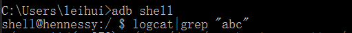
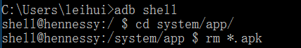
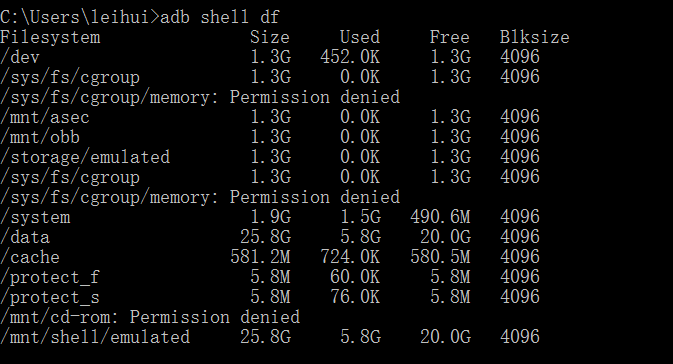

### Android在以下几个时间点会创建应用上下文  

- 创建Application
- 创建Activity
- 创建Service

> Application, Activity, Service都是继承自Context。  
> 创建Context的时机就是在创建Context的实现类的时候。当应用程序第一次启动时，  
> Android系统都会创建一个Application对象，同时创建Application Context，  
> 所有的组件都共同拥有这个Context对象，这个Context对象贯穿整个应用进程的生命周期。  
> 创建Activity和Service组件时，系统也会给它们提供运行的上下文，  
> 即创建Activity实例、Service实例的Context对象。

### Android系统目录

#### system目录

- /system/app/
> 这里面放的是一些系统的App。

- /system/bin/
> 这里面主要放的是Linux自带的组件。

- /system/build.prop
> 这里记录的是系统的属性信息。

- /system/fonts/
> 系统字体存放目录，root后可下载TFT格式字体替换原字体。达到修改系统字体的效果。

- /system/framework/
> 系统的核心文件、框架层。

- /system/lib/
> 存放几乎所有的共享库(.so)文件，一些手机中的.so库文件。

- /system/media/
> 该目录用来保存系统提示音、系统铃声，  
> 其中/system/media/audio/目录，这里面保存着Android系统默认的铃声，  
> alarms目录是闹铃提醒，notification目录是短信或提示音，  
> ringtones目录是来电铃声，而ui目录则是一些界面音效。

- /system/usr/
> 该目录用来保存用户的配置文件，如键盘布局、共享、时区文件等。

#### data目录
> data目录包含了用户的大部分数据信息。

- /data/app/
> 这个目录包含了用户安装的App或者升级的App。

- /data/data/
> 这里包含了App的数据信息、文件信息、数据库信息等，以包名的方式来区分各个应用。

- /data/system/
> 这个目录包含了手机的各项系统信息。

- /data/misc/
> 这个目录保存了大部分的Wi-Fi、VPN信息。

### ADB常用命令

- 安装apk
> 第一种：  
> adb install -r AppName.apk  
> C:\Users\leihui>adb install -r E:\Test.apk  
> 第二种：  
> adb push &lt;local&gt; &lt;remote&gt;  
> C:\Users\leihui>adb push E:\Test.apk /system/app/  
> 以上两种方法都可以安装apk。  
> adb install是将apk安装到data/data/目录下，作为普通的用户应用程序。  
> 而adb push则不是安装命令，是将一个文件写入手机存储系统。  
>   
> 从手机获取文件：  
> adb pull &lt;remote&gt; &lt;local&gt;  

- 查看Log
> 

- 删除应用
> 

- 查看系统盘符
> 

- 输出所有已安装的应用
> 

- 模拟按键输入
> adb shell input keyevent  
>   
> 一些常用的：  
> input keyevent 82 menu  
> input keyevent 3  home  
> input keyevent 19 up  
> input keyevent 20 down  
> input keyevent 21 left  
> input keyevent 22 right  
> input keyevent 66 enter  
> input keyevent 4  back

- 模拟滑动输入
> adb shell input touchscreen x1 y1 x2 y2  
> x1 y1 x2 y2为开始和结束坐标

- 录制屏幕
> adb shell screenrecord /sdcard/demo.mp4

- 重新启动
> 

### 创建自定义View
> 通常需要继承View类，并重写它的onDraw()、onMeasure()等方法来实现绘制逻辑，  
> 同时通过重写onTouchEvent()等触控事件来实现交互逻辑。
