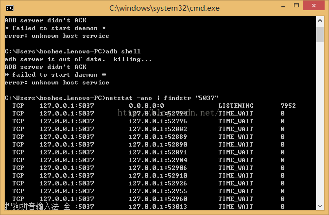
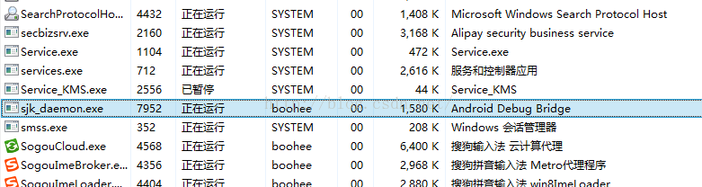

###  adb无法使用，提示error unknown host service的解决办法
> 此时，需要辨别电脑的5037端口被哪个应用程序占用。  
> （使用adb时需要5037端口是空闲的）

#### 1. 打开命令行，输入命令：netstat -ano |findstr "5037"

#### 2. 查看到对应的进程的PID是7952
> 打开任务管理器，查看是哪个进程占用了7952

  

这里sjk_daemon.exe(百度到是金山手机助手)占用了此进程。

#### 3. 结束该进程
#### 4. 如果发现一个进程，多次关闭无法关闭，可以尝试卸载该应用

#### 最后，如果还是无法连接设备，提示devices notfound，可以尝试如下命令：
> adb kill-server  
> adb start-server  
> adb remount
